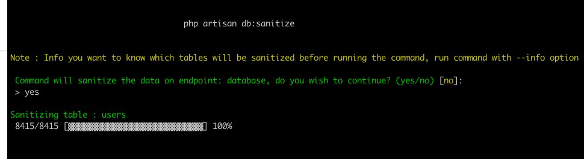
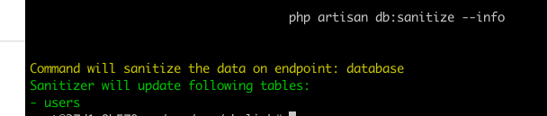

# Sanitize your existing database with dummy data from a single artisan command

Laravel factories and database seeding is really great tool to populate dummy data. However, sometimes all you want is a real production-like data to work with. Because that mostly contains all workflows and different data sets created by different domain events. 

Ideally, it is not a great idea to have real production information in your local development environment as it may contain customer's personal details, patient information etc. This package helps you to `sanitize` your production-like database with dummy values, so you don't have to worry about keeping important production information on your development/testing environments.

## Installation : 

~~~bash
composer require techsemicolon/laravel-database-sanitizer
~~~

## Usage : 

You need to publish the vendor assets to get the `sanitizer.php` config file.

~~~bash
php artisan vendor:publish --provider=\Techsemicolon\Sanitizer\DatabaseSanitizerServiceProvider
~~~

This will have a new config file `config/sanitizer.php`. You can specify which models would need sanitization : 

~~~php
return [

    /*
    |--------------------------------------------------------------------------
    | Models to Sanitize
    |--------------------------------------------------------------------------
    |
    | Add all models which you would like to sanitize
    |
    */

    'models' => [
        User::class
    ],

]
~~~

Each model specified in above configuration needs to have a method called `sanitize`, which will return array of columns to sanitize with dummy values like below : 

~~~php
/**
 * Sanitizer function for model
 */
public function sanitize()
{
    return [
        'first_name' => function($model, $faker){
            return $faker->firstName;
        },
        'middle_name' => function($model, $faker){
            return $faker->firstName;
        },
        'last_name' => function($model, $faker){
            return $faker->lastName;
        },
        'phone' => '+1-123-123-1231'
    ];
}
~~~

And then finaly run the command : 

~~~bash
php artisan db:sanitize
~~~

    

This will put dummy values in `first_name`, `middle_name`, `last_name` and `phone` columns for `User` Model. However, the fun part is that, dummy values for `first_name`, `middle_name` and `last_name` will be different and generated by `Faker` library as used in laravel factories.. The `phone` contains a static string value.

You can also have conditional dummy value based on specific model like below : 
~~~php
/**
 * Sanitizer function for model
 */
public function sanitize()
{
    return [
        'is_local' => function($model, $faker){
            return $model->country == 'USA';
        }
    ];
}
~~~

If you would like to know which tables will be sanitized before actually running the command, you can pass `--info` option : 
~~~bash
php artisan db:sanitize --info
~~~

    

If you would like to sanitize some specific tables only, you can pass `--tables=` with comma separated `mysql` table names : 
~~~bash
php artisan db:sanitize --tables=users,customers
~~~

## License : 

This psckage is open-sourced software licensed under the MIT license